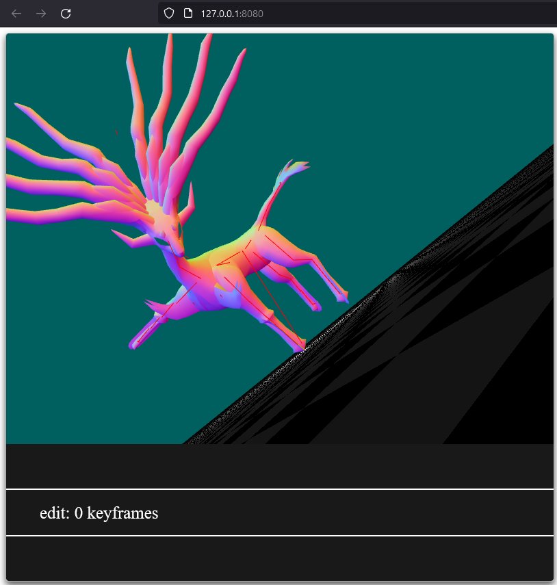

# virtual-mannequin

Project 3 for CS 384G -- Sidharth Nair (sn25377), Jeffrey Liu (jl72726)

Partner contribution breakdown: We contributed about equally to the features.

## Features

### Required

- [✓] (15 pts) Bone Picking
- [✓] (15 pts) Bone Manipulation
- [✓] (20 pts) Linear-blend Skinning

### Extra Credit

- [✓] (10 pts) 🔔 Find or create your own character model, rig, and skinning weights, and create some images showcasing different poses of the character.

We found a collada file for the Pokemon Xerneas and added it to the list of files that can be opened with the GUI (use the '8' key). Please find a few images of different poses in the `poses/` directory

